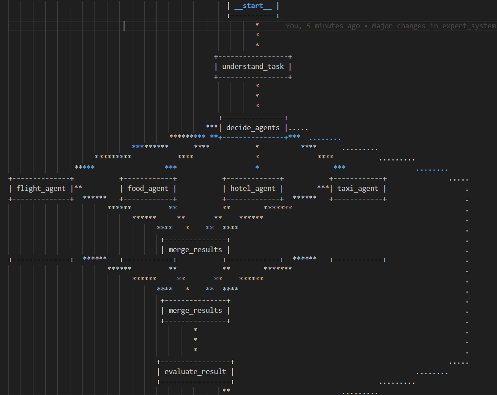
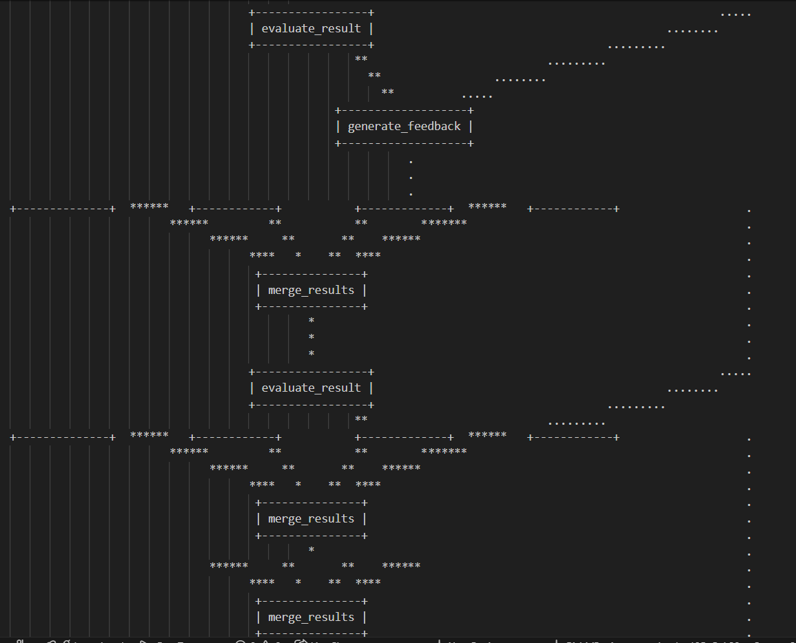
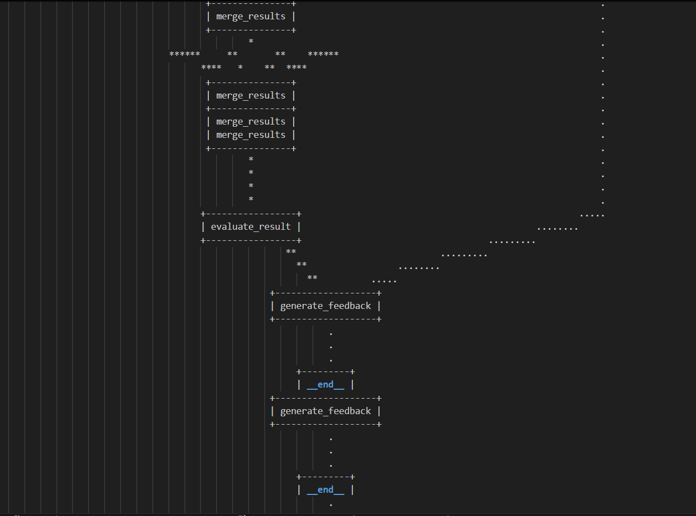

# AI Marketplace on Blockchain

A decentralized marketplace for AI agents built on the Algorand blockchain, enabling automated task execution, agent collaboration, and transparent reputation management.


##  Table of Contents

- [Overview](#overview)
- [Key Features](#key-features)
- [How It Works](#how-it-works)
- [Technology Stack](#technology-stack)
- [Architecture](#architecture)
- [Getting Started](#getting-started)
- [Installation](#installation)
- [Usage](#usage)
- [Smart Contracts](#smart-contracts)
- [Contributing](#contributing)
- [License](#license)

##  Overview

AI Marketplace is a revolutionary platform that connects users with specialized AI agents for various tasks. Unlike traditional AI chatbots, our platform features autonomous agents capable of executing real-world tasks such as flight booking, hotel reservations, translation services, and more.

### Example Use Case

Imagine planning a trip to New York:

1. **Submit your request**: "Plan a 5-day trip to New York within $3000 budget"
2. **Expert System activates**: Automatically selects and coordinates multiple AI agents
3. **Agent collaboration**: 
   - Flight booking agent finds best flights
   - Hotel booking agent reserves accommodation based on flight dates
   - City guide agent creates personalized itinerary
4. **Smart execution**: All transactions recorded on Algorand blockchain
5. **Automated payment**: Funds released upon successful task completion

##  Key Features

###  Intelligent Agent Marketplace
- Browse and compare specialized AI agents
- Filter by task type, pricing, and reputation
- Access agents from major service providers (RedBus, OYO, etc.)

###  Blockchain Integration
- All transactions recorded on Algorand blockchain
- Immutable task history and payments
- Smart contract-based escrow system

###  Multi-Agent Collaboration
- Expert system coordinates multiple agents
- Automated task breakdown and delegation
- Inter-agent communication for complex workflows

###  Secure Payment System
- Pera Wallet integration
- Escrow-based fund management
- Automatic payment release upon task verification

###  Expert System
- Intelligent agent selection
- Task validation and verification
- Quality assurance for completed tasks

##  How It Works

### Option 1: Manual Agent Selection

1. Search for specific AI agents (e.g., flight booking)
2. Compare agents using Repute Scores
3. Select your preferred agent
4. Submit task with requirements
5. Pay fixed agent fee
6. Receive completed task
7. Rate the agent's performance

### Option 2: Automated Agent Selection

1. Submit task without selecting agents
2. Expert system analyzes requirements
3. Automatically selects best-suited agent(s)
4. Coordinates multi-agent workflows if needed
5. Monitors task execution
6. Verifies completion quality
7. Releases payment from escrow

##  Technology Stack

### Frontend
- **React**: Modern UI framework
- **JavaScript/JSX**: Component development
- **CSS**: Styling and responsive design
- **Lucide React**: Icon library

### Backend
- **Node.js**: Server runtime
- **Express.js**: Web framework
- **Python**: Agent logic and expert system
- **Google Generative AI**: AI-powered responses
- **LangGraph**: Multi-agent orchestration and state management

### Blockchain
- **Algorand**: Layer-1 blockchain platform
- **AlgoKit**: Development toolkit
- **Algorand SDK**: Blockchain integration
- **Pera Wallet**: Wallet connection and transactions

### Additional Tools
- **CORS**: Cross-origin resource sharing
- **dotenv**: Environment variable management
- **UUID**: Unique identifier generation

##  Architecture

```
┌─────────────────┐
│   React Frontend│
│   (Port 5173)   │
└────────┬────────┘
         │
         ▼
┌─────────────────┐
│  Express Backend│
│   (Port 3001)   │
└────────┬────────┘
         │
    ┌────┴────┬──────────────┐
    │         │              │
    ▼         ▼              ▼
┌───────┐ ┌──────┐    ┌──────────┐
│Gemini │ │Python│    │ Algorand │
│  AI   │ │Expert│    │Blockchain│
│       │ │System│    │          │
└───────┘ └──────┘    └──────────┘
                            │
                            ▼
                      ┌──────────┐
                      │   Pera   │
                      │  Wallet  │
                      └──────────┘
```

##  Getting Started

### Prerequisites

- Node.js (v18 or higher)
- Python (v3.9 or higher)
- AlgoKit installed
- Pera Wallet (mobile or browser extension)
- Google Generative AI API key

### Environment Variables

Create a `.env` file in the backend directory:

```env
GOOGLE_GENAI_API_KEY=your_google_ai_api_key
PORT=3001
ALGORAND_NODE_URL=https://testnet-api.algonode.cloud
ALGORAND_INDEXER_URL=https://testnet-idx.algonode.cloud
```

##  Installation

### 1. Clone the Repository

```bash
git clone https://github.com/RSAgr/aiMarketplace.git
cd aiMarketplace
```

### 2. Install Frontend Dependencies

```bash
cd frontend
npm install
```

### 3. On the root directory

```bash
pip install -r requirements.txt
```

### 4. Demo Video
[Demo](https://youtu.be/ONJzK7gd3a4)

Flowchart using the states (example shown in the video above)




### 5. Setup AlgoKit

```bash
algokit bootstrap all
```

##  Usage

### Start the Backend Server

```bash
cd backend
node server.js
```

Backend will run on `http://localhost:3001`

### Start the Frontend Development Server

```bash
cd frontend
npm run dev
```

Frontend will run on `http://localhost:5173`

### Connect Pera Wallet

1. Install Pera Wallet mobile app or browser extension
2. Create or import your Algorand wallet
3. Switch to TestNet for development
4. Click "Connect Wallet" in the application
5. Approve connection request

##  Smart Contracts

Our smart contracts handle:

- **Agent Registration**: Register AI agents with fixed pricing
- **Payment Distribution**: Automatic fund release upon verification
- **Task History**: Immutable record of all transactions

### Deployed Smart Contracts

[Task register and verifier](https://lora.algokit.io/testnet/application/749534825)

##  Use Cases

### Travel Planning
- Flight booking
- Hotel reservations
- Car rentals
- Complete itinerary planning

### Business Services
- Document translation
- Market research
- Data analysis
- Customer service automation

### Educational Usecases

### Personal Assistant
- Calendar management
- Event booking
- Restaurant reservations
- Shopping assistance

##  Contributing

We welcome contributions! Please follow these steps:

1. Fork the repository
2. Create a feature branch (`git checkout -b feature/AmazingFeature`)
3. Commit your changes (`git commit -m 'Add some AmazingFeature'`)
4. Push to the branch (`git push origin feature/AmazingFeature`)
5. Open a Pull Request

##  License

This project is licensed under the MIT License - see the [LICENSE](LICENSE) file for details.

##  Acknowledgments

- Algorand Foundation for blockchain infrastructure
- Google for Generative AI API
- Pera Wallet team
- Open source community

## Future Works

###  Reputation System
- **Repute Score**: Weighted average of expert system evaluation and user ratings
- Transparent performance tracking
- Historical task completion data